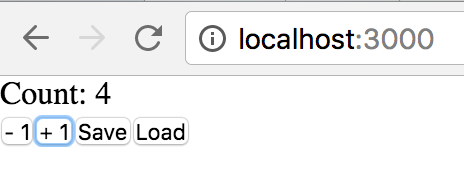

## React App Template

Minimal React + Express.js app that counts a number and allows you to save/load it from the server.



### Installing

1. Open the terminal and run:

    ```bash
    git clone https://github.com/maiavictor/react-app-template
    cd react-app-template
    npm install
    npm run build
    node src/server.js
    ```

2. Access `http://localhost:3000`.

### Modifying

1. Edit `src/client.js` (front-end) and `src/server.js` (back-end).

2. Open the terminal and run:

    ```bash
    npm run build
    node src/server.js
    ```

3. Access `http://localhost:3000`.


